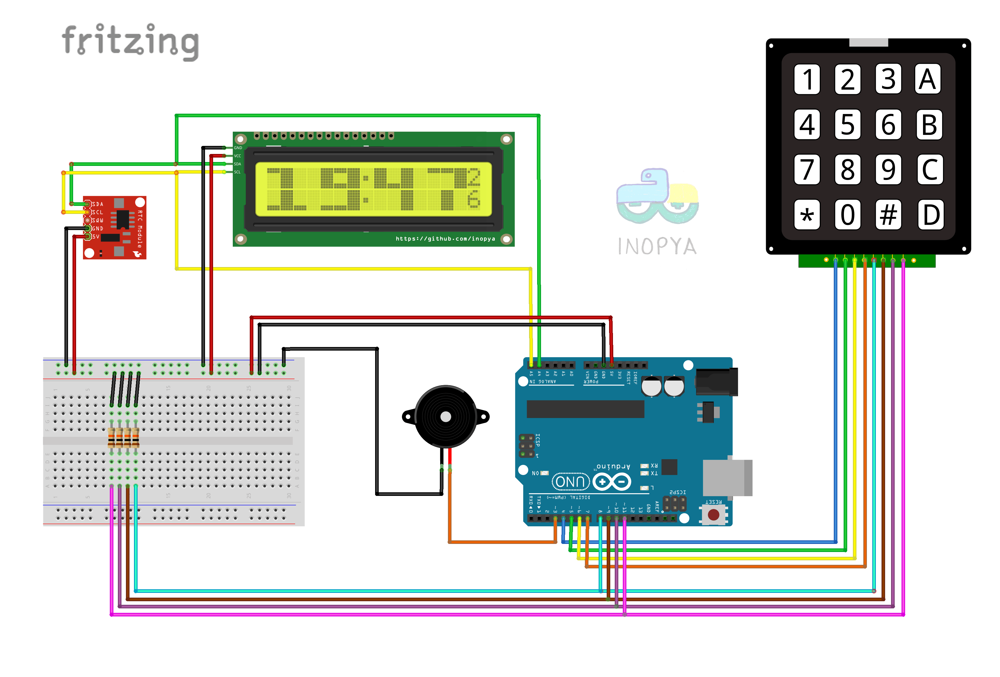

# RELOJ DESPERTADOR ARDUINO:

     
```diff
+===== NOTAS DE LA VERSION =====
```	  
 - Sencillo reloj despertador con alarma programable y mantenida durante 10 minutos, (salvo interaccion del usuario)


```diff
+===== LISTA DE MATERIAL =====
```	  
 - 1x Arduino UNO
 - 1x RTC DS1307
 - 1x LCD 16x2 i2c
 - 1x KeyPad 4x4
 - 1x Buzzer
 - 4x Resistencia 10K
 - 1x BreadBoard
 - Cables Dupont


```diff
+===== OPCIONES DISPONIBLES ===== 
```	

 - Programacion de alarma, activacion, desactivacion y parada de esta en funcionamiento. Encender luz para consultar la hora
 
  La pulsacion de cualquier tecla enciende la luz del display para facilitar la lectura.
  y no hace nada mas. Para cualquier accion de teclado se ha de pulsar una segunda vez 
  en este caso la tecla deseada. 
  Vease funcion de cada tecla:
  
  'A' --> Programar la alarma (solo si la luz esta encendida, de modo que un manotazo nocturno para consultar la hora
          impida que entremos en programacion).            
          El display mostrara en la parte derecha los caracteres 'ON' u 'OF' 
          segun el estado actual de la alarma. ¡Modificarla no significa activarla!.
          Para Activarla o desactivarla, debemos entrar en modo 'Programacion Alarma' y pulsar la tecla 'B'
          Eso dejara los valores actuales pero conmutará el estado de la alarma y nos motrara una mensaje 
          del estado en que ha quedado.

  'B' --> Programar la hora del reloj (solo si la luz esta encendida...)
          El display mostrara en la parte derecha los caracteres 'H?'

          ** Dentro de los modo de programacion 'A' y 'B' el digito objeto de modificacion 
             parpadeará con una cadencia de 750ms.Si se dejan de pulsar teclas durante 
             mas de 45 segundos, se abandona una programacion automaticamente 
             y se cancela cualquier cambio en progreso.
          
  'C' --> Cancelar/anular el proceso de programacion de Hora o Alarma que se haya iniciado.
  
  'D' --> Aceptar una programacion en curso, tanto del Reloj como de la Alarma o Apagar la luz (si esta encendida)
  
  '*' --> Consultar la hora de alarma programada. 
  
  '1,2,3,4,5,6,7,8,9,0' --> digitos para programar tiempos.
  
  '*' y '#' Actuan como flechas de desplazamiento a izquierda y derecha respectivamente si estamos en modo programación.
 
   
   >> Fecha: 06/02/2016 
      - Version inicial con todo lo que necesita para ser un buen despertador 
    
   >> Fecha: 04/06/2016 
      - Añadida la opcion de luz de cortesia que ilumina el display al tocar una tecla 
        para facilitar la lectura de la hora durante la consultas nocturnas.
 

   
   Tamaño actual compilado 8190 bytes de programa y 553 bytes de uso de RAM


```diff
+===== ESQUEMA DE CONEXION ===== 
```	




* Me he contrado con varias librerias LCD_i2c con el mismo nombre pero pequeñas variaciones. Asi que para no incurrir en errores adjunto en un fichero .rar las que se usa en este montaje
